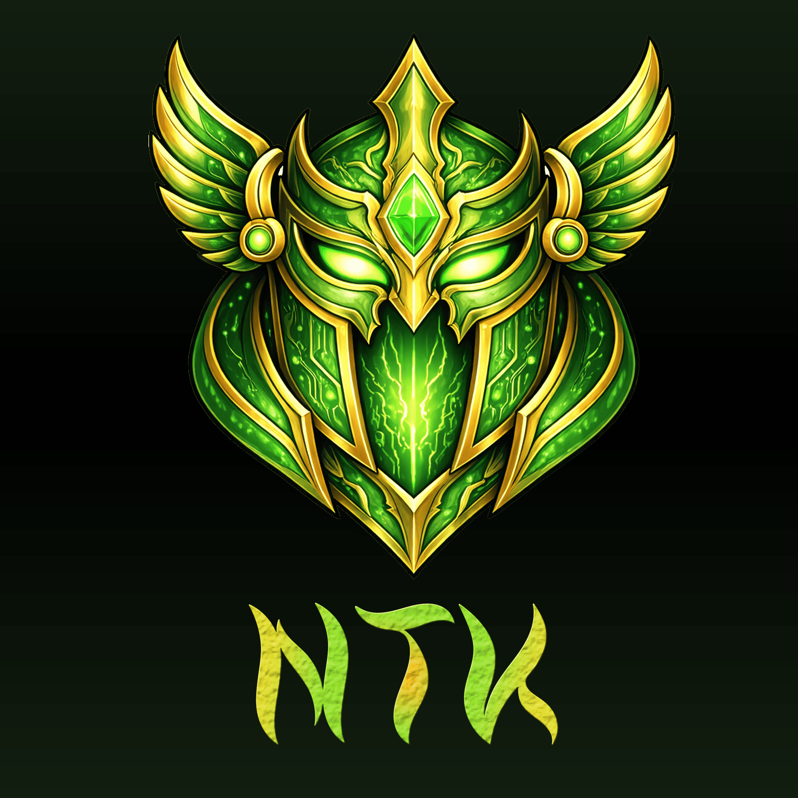

<div align="center">



# NTK · Neural Token Killer

**Semantic compression proxy for Claude Code — reduces tool output by 60–90 % before it reaches the model.**

[](https://github.com/VALRAW-ALL/ntk/actions/workflows/ci.yml)
[](https://github.com/VALRAW-ALL/ntk/releases)
[](https://opensource.org/licenses/MIT)
[](https://www.rust-lang.org)
[](https://github.com/VALRAW-ALL/ntk/issues)

[Website](https://ntk.valraw.com) • [Install](#installation) • [Usage](#usage) • [Contributing](CONTRIBUTING.md) • [How to open an issue](HOW_TO_OPEN_AN_ISSUE.md) • [Report an issue](https://github.com/VALRAW-ALL/ntk/issues/new/choose)

</div>

> **v0.3.0** — Four-layer compression pipeline. 6 new L1 stages (multi-cluster prefix factor, suffix factor, n-gram block dedup, package/version normalize, gradle classifier, single-digit normalize) lift the 34-fixture corpus average from 9.7% → 49.3%. Local neural inference via Ollama / Candle / llama.cpp (optional, GPU-accelerated). Claude-compatible `cl100k_base` tokenizer. No cloud dependency.

> ⚠ **This project is an open initiative — it needs your help to evolve.**
> NTK started as a one-person effort and the surface area (languages,
> frameworks, GPUs, editors) has outgrown solo maintenance. If you've
> ever stared at a 10 000-line log and wished your LLM didn't burn
> context on it, the quickest way to make this tool better is to
> contribute a fixture, translate the docs, port the hook to another
> editor, or benchmark on hardware we don't own. See
> **[CONTRIBUTING.md](CONTRIBUTING.md)** for starter tasks — most take
> under an hour and land as a single PR.

---

## Table of Contents

- [What it does](#what-it-does)
- [How it works](#how-it-works)
- [Requirements](#requirements)
- [Installation](#installation)
- [Usage](#usage)
- [Configuration](#configuration)
- [GPU Acceleration](#gpu-acceleration)
- [Security Model](#security-model)
- [RTK + NTK Coexistence](#rtk--ntk-coexistence)
- [Development](#development)
- [Contributing](#contributing)
- [Privacy Policy](#privacy-policy)
- [License](#license)
- [Third-Party Licenses](#third-party-licenses)

---

## What it does

Every time Claude Code runs a Bash command, the output is fed back into the model context. Long outputs from `cargo test`, `tsc`, Docker logs, or `git diff` can consume hundreds or thousands of tokens - slowing down responses and eating through context budgets.

NTK intercepts those outputs via the `PostToolUse` hook, compresses them semantically, and returns a compact version that preserves all errors, warnings, and actionable information. Claude sees less noise, responds faster, and stays focused longer.

**Typical savings** (measured on 34 deterministic fixtures in
`bench/fixtures/`; L1+L2 only — L3 adds another 30–80 pp on top when
its token threshold triggers):

| Output type | Example | Savings |
|---|---|---|
| Repetitive logs | Docker / journal-style with timestamp + level | ~97% |
| Stack traces (TS / Node / Ruby) | site-packages / framework frames collapsed | 83–92% |
| Build tools (Gradle / Bazel / Cargo / Maven) | per-task prefix + version normalize | 55–90% |
| `terraform plan` | N nearly-identical `+ resource` blocks | ~88% |
| `pnpm install` | 30+ `+ pkg X.Y.Z` lines | ~78% |
| Stack traces (Java / Python / Go / .NET) | hardcoded framework matrix | 57–63% |
| `git diff` (many hunks) | Multi-file diff with index/+++/--- noise | ~57% |
| `tsc` errors | wavy-underline stripped, dedup | ~33% |

Aggregate across the 34-fixture corpus: **57.4%** token reduction
(40 631 → 17 313 tokens), **49.3%** average per-fixture ratio.

---

## How it works

NTK runs as a local daemon (`127.0.0.1:8765`) and processes output through three layers:

```
Bash tool output
  → PostToolUse hook (ntk-hook.sh / ntk-hook.ps1)
  → HTTP POST /compress  (:8765)
    → Layer 1: Fast Filter       (<1ms)   - ANSI strip, progress bars (cargo Compiling/Checking/etc), diagnostic noise (TS wavy underlines, git index/---/+++ metadata), template dedup, stack-trace collapse, prefix factoring, test-failure extraction, blank-line collapse
    → Layer 2: Tokenizer-Aware   (<5ms)   - BPE path shortening, prefix consolidation (cl100k_base)
    → Layer 3: Local Inference   (opt.)   - Ollama/Phi-3 Mini; only activates above token threshold
  → Compressed output → Claude Code context
```

**Layer 3 activates only when** token count after L1+L2 exceeds `inference_threshold_tokens` (default: 300). Small outputs like `git status` pass through at sub-millisecond latency.

If the daemon is unreachable, the hook falls back gracefully to the original output - NTK never blocks a command.

### Experimental: YAML rule engine (RFC-0001)

NTK ships an opt-in declarative rule engine that lets the community add new
language/framework collapses without writing Rust. Rules live in `rules/*.yaml`
and cover Python, Java, Go, Node, Ruby, PHP, .NET, Kotlin, Rust, Swift, Elixir,
Docker, and kubectl. Activation is one line of config or one env var:

```bash
# All shipped rulesets, composed in filename order
export NTK_SPEC_RULES="$(realpath rules/stack_trace)"
ntk start

# Or persist via ~/.ntk/config.json:
#   { "compression": { "spec_rules_path": "~/.ntk/rules" } }
```

The engine runs as an L1.5 stage between L1 and L2 with a built-in
`preserve_errors` invariant — any rule whose transform would lose error
signal is dropped at runtime, so worst-case the stage is a pass-through.
Full schema: [`docs/rfcs/0001-context-linter-spec.md`](docs/rfcs/0001-context-linter-spec.md).
A second-runtime JS reference (`@ctxlint/core` + `ctxlint` CLI shim) lives at
[`bindings/ctxlint-js/`](bindings/ctxlint-js/) for non-Rust agents.

---

## Requirements

| Requirement | Version |
|---|---|
| Rust | 1.75+ (2021 edition) |
| Cargo | bundled with Rust |
| OS | Windows 10+, macOS 12+, Linux (glibc 2.31+) |

**Optional (for Layer 3 inference):**

| Requirement | Notes |
|---|---|
| [Ollama](https://ollama.com) | Recommended. Manages model download and GPU offloading. |
| NVIDIA GPU (CUDA) | RTX series recommended; tested on RTX 3060+. Detected via `nvidia-smi`. |
| AMD GPU | Detected via `rocm-smi`, Windows driver registry, or Linux sysfs — covers Polaris/Vega/RDNA even without ROCm. Inference uses `llama-server` with Vulkan. |
| Apple Silicon (Metal) | M1 and later |

---

## Installation

### Option 1 - From source (recommended while in pre-release)

```bash
# Clone and build
git clone https://github.com/VALRAW-ALL/ntk
cd ntk
cargo build --release

# Install binary to PATH
cargo install --path .

# Register the PostToolUse hook in Claude Code
ntk init -g

# Configure the Layer 3 backend (separate step — see below)
ntk model setup
```

### Option 2 - Shell installer (Unix)

```bash
curl -fsSL https://ntk.valraw.com/install.sh | bash
```

The installer enumerates every discrete GPU on the machine (NVIDIA and
AMD, any number and any vendor mix) and asks which release variant to
download: **NVIDIA** (`-gpu` CUDA build), **AMD** (`-cpu` build + guidance
to set up a Vulkan llama-server), or **CPU only** (`-cpu` build). When
piped non-interactively, the choice is made automatically from detection
and can be overridden with `NTK_INSTALL_PLATFORM=nvidia|amd|cpu`.

### Option 3 - PowerShell installer (Windows)

Recommended (works around `Read-Host` losing the GPU prompt under
`irm | iex` pipe buffering):

```powershell
$tmp = "$env:TEMP\ntk-install.ps1"
irm https://ntk.valraw.com/install.ps1 -OutFile $tmp
powershell -ExecutionPolicy Bypass -File $tmp
```

One-liner alternative (only works if you don't need the interactive
GPU picker — set `$env:NTK_INSTALL_PLATFORM` first):

```powershell
$env:NTK_INSTALL_PLATFORM = 'nvidia'   # or 'amd' | 'cpu'
irm https://ntk.valraw.com/install.ps1 | iex
```

Same logic as the Unix installer. Override with
`$env:NTK_INSTALL_PLATFORM = 'nvidia' | 'amd' | 'cpu'` for unattended runs.

### What `ntk init -g` does

1. Copies the hook script to `~/.ntk/bin/` (`ntk-hook.sh` on Unix, `ntk-hook.ps1` on Windows)
2. Patches `~/.claude/settings.json` to register the `PostToolUse` hook (idempotent - safe to run multiple times)
3. Creates `~/.ntk/config.json` with sensible defaults

That's it. `ntk init` configures NTK itself — nothing more. Model backend
choice, Ollama / llama-server installation, and GPU selection all live
under `ntk model setup` (see [Model management](#model-management-layer-3))
and can be re-run at any time.

```json
// ~/.claude/settings.json  (added by ntk init -g)
{
  "hooks": {
    "PostToolUse": [{
      "matcher": "Bash",
      "hooks": [{ "type": "command", "command": "~/.ntk/bin/ntk-hook.sh" }]
    }]
  }
}
```

**Other editors:**

```bash
ntk init -g --opencode     # OpenCode (same PostToolUse hook spec as Claude Code)
ntk init -g --cursor       # Cursor — MCP integration via ~/.cursor/mcp.json
ntk init -g --zed          # Zed — MCP via context_servers in Zed settings.json
ntk init -g --continue     # Continue — MCP via mcpServers array in ~/.continue/config.json
```

Cursor, Zed, and Continue register NTK as a **Model Context Protocol
server** (`ntk mcp-server`) that the agent calls on-demand via the
`compress_output` tool. MCP mode is self-contained — no `ntk start`
daemon required. For the full matrix and integration details see
[`docs/editor-integrations.md`](docs/editor-integrations.md).

**Verify the installation:**

```bash
ntk init --show
```

**Remove the hook:**

```bash
ntk init --uninstall
```

---

## Usage

### Daemon lifecycle

```bash
ntk start           # Start daemon on 127.0.0.1:8765  (opens live TUI dashboard)
                    # If daemon is already running: attaches to the live TUI dashboard
ntk start --gpu     # Start with GPU inference enabled
ntk stop            # Stop the daemon
ntk status          # Show daemon status, loaded model, GPU backend
ntk dashboard       # Combined status + session gain + ASCII bar chart (plain text, non-interactive)
```

**Live dashboard** - `ntk start` opens a full-screen TUI that updates every 500 ms. If the daemon is already running in the background, `ntk start` detects it and **attaches** to the live TUI without restarting the daemon. Press **Ctrl+C** to exit the TUI - the daemon keeps running:

```
┌─────────────────────────────────────────────────────────────┐
│ ██╗  ██╗████████╗██╗  ██╗                                   │
│ ████╗ ██║╚══██╔══╝██║ ██╔╝   Neural Token Killer            │
│ ██╔██╗██║   ██║   █████╔╝    v0.2  •  127.0.0.1:8765       │
│ ██║╚████║   ██║   ██╔═██╗    Uptime: 3m 12s                 │
│ ██║ ╚███║   ██║   ██║  ██╗   Backend: candle [GPU] phi3:mini│
│ ╚═╝  ╚══╝   ╚═╝   ╚═╝  ╚═╝                                 │
├─────────────────── SESSION METRICS ─────────────────────────┤
│  Compressions: 47     Tokens In: 84,291  →  Out: 12,048     │
│  Saved: 72,243 tokens  •  Avg ratio: 85%                    │
│                                                             │
│  L1  ████████████████░░░░  38 runs                          │
│  L2  ██████░░░░░░░░░░░░░░   7 runs                          │
│  L3  ██░░░░░░░░░░░░░░░░░░   2 runs                          │
├─────────────────── RECENT COMMANDS ─────────────────────────┤
│  10:14:22  cargo test              1,842  →  312    L2  83% saved │
│  10:14:08  git diff HEAD~1           940  →  188    L2  80% saved │
│  10:13:51  docker logs api         3,200  →  412    L2  87% saved │
└─────────────────────────────────────────────────────────────┘
```

Press **Ctrl+C** in the **attached** TUI to exit the dashboard without stopping the daemon. Press **Ctrl+C** when you started the daemon (first `ntk start`) to stop it gracefully. When stdout is not a TTY (piped or CI), `ntk start` falls back to a single status line.

**Static dashboard** - `ntk dashboard` prints a combined snapshot to stdout and exits immediately (no event loop, always safe to use in scripts or CI):

```
● NTK daemon  running  127.0.0.1:8765  up 3m 22s  candle [GPU] phi3:mini q5_k_m
  14382 tokens saved across 47 compressions (78% avg ratio)

┌─ NTK · Token Savings ──────────────────────────────────────────────────────┐
│                                                                              │
│  cargo     ████████████████████████████████████████  41823 tok  58%         │
│  git       ████████████████████                      21204 tok  29%         │
│  docker    ████████                                   9101 tok  13%         │
│                                                                              │
│  47 compressions · 72128 tokens saved · 78% avg                             │
└──────────────────────────────────────────────────────────────────────────────┘
```

### Metrics and history

```bash
ntk gain            # Token savings summary (RTK-compatible format)
ntk metrics         # Per-command savings table (requires daemon running)
ntk graph           # ASCII bar chart of savings over time
ntk history         # Last 50 compressed commands with token counts
ntk tail            # Show the last 10 compressions and exit
ntk tail -f         # Stream compression events live (polls ~/.ntk/metrics.db)
ntk tail -f --command cargo   # Filter: only commands that start with 'cargo'
ntk prune --older-than 30     # Delete records older than 30 days + VACUUM
ntk prune --dry-run           # Show what would be deleted without deleting
ntk discover        # Scan latest Claude transcript for missed compression opportunities
```

**HTTP dashboard** — when the daemon is running, navigate to
`http://127.0.0.1:8765/dashboard` for a zero-dependency HTML page
that polls `/metrics` every 5 s. First load prompts for the
`X-NTK-Token` (from `~/.ntk/.token`); the value is kept in
sessionStorage only.

**Example `ntk gain` output:**

```
NTK: 14382 tokens saved across 47 compressions (78% avg)
```

**Example `ntk history` output:**

```
COMMAND                 TYPE      BEFORE     AFTER  RATIO  LAYER  TIME
--------------------------------------------------------------------------------
cargo test              test        1842       312   83%   L2     2026-04-11 10:00
git diff HEAD~1         diff         940       188   80%   L2     2026-04-11 10:01
docker logs api         log         3200       412   87%   L2     2026-04-11 10:02
```

### Testing compression

```bash
# Test compression on any file without the daemon
ntk test-compress tests/fixtures/cargo_test_output.txt

# Full per-layer breakdown (applied rules + tokens + latency + preview
# per stage). Useful for debugging "why did L1 drop/keep this line?".
ntk test-compress tests/fixtures/cargo_test_output.txt --verbose

# Unified diff between the raw input and a specific layer's output.
# Shows exactly which lines each stage removed or rewrote.
ntk diff tests/fixtures/cargo_test_output.txt --layer l1
ntk diff tests/fixtures/cargo_test_output.txt --layer l2 --context 3
```

Non-verbose output:

```
File:             tests/fixtures/cargo_test_output.txt
Original tokens:  512
L1 lines removed: 46
After L2 tokens:  76
Compression:      85.2%

--- Compressed output ---
...
```

Verbose output adds `Applied: ansi_strip(65 chars), template_dedup(3 groups),
stack_trace_collapse(1 run)` + latency per layer + a 20-line preview of
the intermediate output after each stage.

### Terminal output

All NTK commands emit colored, animated output when connected to a TTY. Colors are disabled automatically when:

- stdout is redirected to a file or pipe
- The `NO_COLOR` environment variable is set (respects the [no-color.org](https://no-color.org) convention)

Commands that perform inference show a real-time progress animation:

```
⠹ Running inference …           12.3s  [4821 chars]
```

`ntk model bench` shows per-payload progress with elapsed time updating every 250ms while inference runs, followed by a colored results table where compression ratio and latency are color-coded (green → yellow → red by severity).

### Model management (Layer 3)

```bash
# Interactive backend + hardware setup wizard.
# Run this after `ntk init` (or anytime you want to change backend / GPU).
# Detects Ollama, every NVIDIA / AMD GPU on the system, and installs
# Ollama on demand when you pick that backend.
ntk model setup

# Download the default model via Ollama
ntk model pull

# Download a specific quantization
ntk model pull --quant q4_k_m   # faster, less RAM
ntk model pull --quant q6_k     # better quality, more RAM

# Test inference latency and output quality
ntk model test

# Test with verbose debug output:
#   hardware config, thread counts, mlock status, system prompt preview,
#   timing breakdown, and performance analysis with CPU-tier-aware targets
#   (mobile/low-power ≥5 tok/s, desktop ≥10, high-end ≥15, GPU ≥40)
ntk model test --debug

# Benchmark CPU vs GPU
ntk model bench

# List available models in the configured backend
ntk model list
```

### Layer testing and benchmarks

```bash
# Run correctness tests on all compression layers (no daemon required)
ntk test

# Include Layer 3 inference in the test run
ntk test --l3

# Benchmark all compression layers (default: 5 runs per payload)
ntk bench

# More runs for stable measurements
ntk bench --runs 20

# Include Layer 3 in benchmark
ntk bench --l3

# Emit a structured JSON report — attach to a GitHub issue so
# maintainers can compare numbers across hardware.
ntk bench --submit
ntk bench --submit --output bench-report.json
```

### Model backend install (llama.cpp + GPU)

```bash
# Re-install only the llama-server binary for the current OS + vendor.
# Picks the right asset automatically from the latest llama.cpp release:
#   nvidia → CUDA 13.1 > 12.4 > vulkan
#   amd    → vulkan > hip-radeon
#   intel  → sycl > vulkan
#   apple  → macos (Metal bundled)
#   none   → vulkan > avx2 (safe default)
ntk model install-server
```

Set `config.model.gpu_vendor` first (or via `ntk model setup`) so the
selector picks the right build. Then restart the daemon to pick up
the new binary.

### MCP server (Cursor / Zed / Continue)

```bash
# Launched automatically by the MCP client (Cursor/Zed/Continue) as
# a stdio JSON-RPC subprocess. Do NOT run this manually — it reads
# JSON-RPC from stdin and prints responses to stdout.
ntk mcp-server
```

Exposes a single tool: `compress_output(output, command?)`. Runs
L1+L2 in-process, no daemon required.

### Configuration

```bash
# Show active config
ntk config

# Show config from a specific file
ntk config --file /path/to/.ntk.json
```

---

## Configuration

NTK merges configuration from two sources, in order:

1. `~/.ntk/config.json` - global defaults
2. `.ntk.json` in the current project directory - per-project overrides

**Full reference (`~/.ntk/config.json`):**

```json
{
  "daemon": {
    "port": 8765,
    "host": "127.0.0.1",
    "auto_start": true,
    "log_level": "warn"
  },
  "compression": {
    "enabled": true,
    "layer1_enabled": true,
    "layer2_enabled": true,
    "layer3_enabled": true,
    "inference_threshold_tokens": 300,
    "context_aware": true,
    "max_output_tokens": 500,
    "preserve_first_stacktrace": true,
    "preserve_error_counts": true,
    "context_max_messages": 3,
    "tokenizer": "cl100k_base",
    "spec_rules_path": null
  },
  "model": {
    "provider": "ollama",
    "model_name": "phi3:mini",
    "quantization": "q5_k_m",
    "ollama_url": "http://localhost:11434",
    "timeout_ms": 300000,
    "fallback_to_layer1_on_timeout": true,
    "gpu_layers": -1,
    "gpu_auto_detect": true,
    "gpu_vendor": null,
    "cuda_device": 0,
    "backend_chain": []
  },
  "metrics": {
    "enabled": true,
    "storage_path": "~/.ntk/metrics.db",
    "history_days": 30
  },
  "exclusions": {
    "commands": ["cat", "echo", "printf"],
    "max_input_chars": 500000
  },
  "security": {
    "audit_log": false,
    "audit_log_path": "~/.ntk/audit.log"
  },
  "l3_cache": {
    "enabled": true,
    "ttl_days": 7
  }
}
```

**Key settings:**

| Setting | Default | Description |
|---|---|---|
| `compression.inference_threshold_tokens` | `300` | Layer 3 only activates above this token count |
| `compression.context_aware` | `true` | Layer 4 — when the hook forwards `transcript_path`, NTK extracts the user's most recent request and prepends it to the L3 prompt so the summary focuses on relevant info. Disable for pre-v0.2.27 behaviour. |
| `model.timeout_ms` | `300000` (5 min) | Upper bound on a single `/compress` call. L3 inference on CPU can take 60-180 s on large inputs. The daemon falls back to L1+L2 after this window. Lower to 60 000 for GPU setups. |
| `model.fallback_to_layer1_on_timeout` | `true` | Use L1+L2 output if Ollama is slow or unavailable |
| `model.gpu_layers` | `-1` | `-1` = all layers on GPU; `0` = CPU only |
| `model.gpu_vendor` | `null` | `"nvidia"` / `"amd"` / `"intel"` / `"apple"` — the card the user picked in `ntk model setup`. `null` = auto-detect. Also drives `ntk model install-server` asset selection (CUDA / Vulkan / SYCL / Metal). |
| `model.cuda_device` | `0` | Zero-based device index **within** the chosen vendor (e.g. the first AMD card is `0` in the AMD namespace, independent of how many NVIDIAs are present). |
| `model.backend_chain` | `[]` | Ordered fallback chain of inference backends. E.g. `["ollama", "candle"]` tries Ollama first, falls back to Candle on failure. Empty = single backend from `provider`. |
| `compression.context_max_messages` | `3` | Layer 4 — how many recent user messages to fold into the intent prefix (decay-weighted: most recent 60%, next 25%, etc). `1` = legacy single-message. |
| `compression.tokenizer` | `"cl100k_base"` | BPE family for token counting. `"o200k_base"` for Claude 3.5+ / GPT-4o accuracy. Unknown values fall back to `cl100k_base` with a warn log. |
| `compression.spec_rules_path` | `null` | (Experimental, RFC-0001) Path to a YAML rule file or directory of `*.yaml` rules applied as an extra L1.5 stage between L1 and L2. `NTK_SPEC_RULES=<path>` env var overrides at runtime. Default `null` = behaviour unchanged. The `preserve_errors` invariant guarantees worst-case is a pass-through, never a regression. See `rules/` for shipped rulesets (Python, Java, Go, Node, Ruby, PHP, .NET, Kotlin, Rust, Swift, Elixir, Docker, kubectl). |
| `security.audit_log` | `false` | Opt-in: append one JSONL line per `/compress` call to `audit_log_path`. SHA-256 of the output only — raw output never stored. |
| `security.audit_log_path` | `"~/.ntk/audit.log"` | Destination for the audit JSONL when `audit_log=true`. |
| `l3_cache.enabled` | `true` | Memoize L3 inference results keyed by `SHA-256(l2_output + context + model + prompt_format)`. Cache hit = <5 ms vs fresh L3 at 50-800 ms. |
| `l3_cache.ttl_days` | `7` | Drop cache entries older than this many days on lookup (lazy prune). |
| `exclusions.commands` | `["cat","echo"]` | Commands whose output is never compressed |
| `exclusions.max_input_chars` | `500000` | Hard limit on input size before processing |

**Per-project override example (`.ntk.json` in project root):**

```json
{
  "compression": {
    "inference_threshold_tokens": 100
  },
  "exclusions": {
    "commands": ["make", "just"]
  }
}
```

### Tuning `inference_threshold_tokens` for your hardware

L3 inference latency scales with model size × tokens × hardware. The
threshold sets the minimum output size that justifies the round trip to
the model. Too low and every `git status` pays the L3 tax; too high and
L3 never fires on the outputs that would benefit most.

The L3 cache (`config.l3_cache`) absorbs most of the pain on repeat
calls (identical input → <150 ms), so "first-call latency" is the metric
that matters for the tier choice:

| Hardware | Cold L3 (Phi-3 Mini Q5_K_M) | Recommended threshold | Why |
|---|---|---|---|
| CPU-only (AVX2 modern) | 30-60 s | `2000` or disable L3 | only L1+L2 worth the latency; reserve L3 for heavy batch |
| Polaris / Pascal GPUs (RX 580, GTX 1060) | 10-15 s via Vulkan | `600` | cache warms quickly in long sessions; first hit still noticeable |
| Mid-tier (RTX 3060, RX 6700 XT, M1) | 2-5 s | `300` (**default**) | sweet spot — interactive responsiveness with useful coverage |
| High-tier (RTX 4070+, M2 Pro+) | < 1.5 s | `200` | L3 becomes invisible to the human eye |
| RTX 4090 / M4 Pro+ | < 700 ms | `100` | L3 on nearly every Bash call is realistic |

Find yours empirically:

```bash
ntk bench --l3 --runs 3             # measures avg ms per payload
# Then pick a threshold where p95 ≤ 2 s for interactive feel.
```

The `ntk bench --submit` JSON (#15) includes per-payload latencies you
can cross-reference against the table above when someone shares their
numbers in an issue.

---

## GPU Acceleration

NTK enumerates every discrete GPU on the host — multiple cards, multiple
vendors, mixed setups are all supported — and picks the best CPU fallback
when no GPU is available.

**NVIDIA detection** — `nvidia-smi` (every CUDA device, with accurate VRAM).

**AMD detection** — tries, in order:

1. `rocm-smi` (ROCm-supported cards only)
2. **Windows**: the display-class driver registry (`VEN_1002`), reading
   `HardwareInformation.qwMemorySize` for accurate 64-bit VRAM. This is
   what lets Polaris / Vega cards (e.g. **RX 570 / 580 / Vega 56**) show
   up on Windows even though they are not supported by ROCm.
3. **Linux**: `/sys/class/drm/card*/device/vendor == 0x1002`, with VRAM
   from `mem_info_vram_total` and the product name resolved via
   `lspci -nn -d 1002:<device>`.

**Apple Silicon** — Metal is enabled at compile time on
`aarch64-apple-darwin`.

**CPU fallbacks** — Intel AMX → AVX-512 → AVX2 → scalar.

### Multi-GPU selection

`ntk model setup` lists every detected GPU as its own numbered option
(plus a CPU-only option). When more than one GPU is present, the user
picks explicitly — the chosen **vendor** is saved to
`config.model.gpu_vendor` and the per-vendor **device index** to
`config.model.cuda_device`.

```
  GPU / Compute Selection
  ────────────────────────────────────
  Detected: 2 discrete GPUs

  [1]  CPU  AVX2                      ✓ always available
  [2]  NVIDIA GeForce RTX 3060        ✓ 12288 MB VRAM
  [3]  AMD Radeon RX 580 2048SP       ✓ 8192 MB VRAM

  Choose [1-3] or Enter for [2]:
```

**No hidden vendor preference.** On a machine with both an NVIDIA and an
AMD card, picking AMD in the wizard actually routes inference to the AMD
card. The daemon passes `HIP_VISIBLE_DEVICES` / `ROCR_VISIBLE_DEVICES` /
`GGML_VK_VISIBLE_DEVICES` to the llama-server subprocess when AMD is
selected, and `CUDA_VISIBLE_DEVICES` when NVIDIA is selected. If the
configured vendor is unavailable at runtime (GPU removed / driver
failure), NTK falls back to CPU and warns — it never silently switches to
a different vendor.

> **About the `(device 0)` label.** Each vendor numbers its own devices
> starting at 0, independently. So `NVIDIA GT 730 (device 0)` and
> `AMD RX 580 (device 0)` are different hardware — the disambiguation
> comes from `gpu_vendor`, not from the numeric index.

`ntk status` reports the **configured** backend (respecting `gpu_vendor`),
not the "best detected" one.

**Performance expectations - Phi-3 Mini 3.8B Q5_K_M (Layer 3 latency p95):**

| Backend | Hardware example | p50 | p95 |
|---|---|---|---|
| CUDA | RTX 3060 | ~50ms | ~80ms |
| CUDA | RTX 5060 Ti | ~30ms | ~50ms |
| AMD ROCm | RX 6800 XT | ~80ms | ~130ms |
| Metal | M2 MacBook Pro | ~80ms | ~150ms |
| Intel AMX | Xeon 4th Gen | ~150ms | ~250ms |
| AVX2 CPU | i7-12700 | ~300ms | ~500ms |
| AVX2 CPU | i5-8250U | ~600ms | ~900ms |

Layer 3 is skipped entirely for outputs below the threshold (default 300 tokens), so most small commands like `git add` or `ls` add zero latency.

**Build options:**

```bash
# Default build — Candle CPU + Ollama / llama-server external.
# Works on any machine, including AMD GPUs (inference routes through
# llama-server built with Vulkan, configured via `ntk model setup`).
cargo build --release

# CUDA (NVIDIA) — enables in-process GPU offloading via Candle
cargo build --release --features cuda

# Metal (Apple Silicon)
cargo build --release --features metal
```

**Or let the wrapper pick the right flag automatically:**

```bash
# Linux / macOS
./scripts/build.sh

# Windows (PowerShell)
.\scripts\build.ps1
```

The wrapper detects the host GPU + toolchain and adds the correct feature
(or none), so `./scripts/build.sh` does the right thing on an NVIDIA
workstation, an M-series Mac, an AMD box, and a bare CPU server alike.

### Release binary variants

The `release.yml` workflow publishes one binary per platform × scenario,
with a `-cpu` or `-gpu` suffix. All 8 artifacts are built and released
on every version bump:

| Artifact | Contents | CI runner |
|---|---|---|
| `ntk-linux-x86_64-cpu`        | CPU-only, Candle disabled. | ubuntu-latest |
| `ntk-linux-x86_64-gpu`        | Candle + CUDA (sm_80+). Requires NVIDIA driver ≥ 520 at runtime. | nvidia/cuda:12.5.1-devel-ubuntu22.04 container |
| `ntk-linux-aarch64-cpu`       | CPU-only. | ubuntu-latest + taiki-e cross-toolchain |
| `ntk-darwin-x86_64-cpu`       | CPU-only (Intel Macs). | macos-latest |
| `ntk-darwin-aarch64-cpu`      | CPU-only (Apple Silicon). | macos-latest |
| `ntk-darwin-aarch64-gpu`      | Candle + Metal (Apple Silicon). | macos-latest |
| `ntk-windows-x86_64-cpu.exe`  | CPU-only. | windows-latest |
| `ntk-windows-x86_64-gpu.exe`  | Candle + CUDA (sm_80+). Requires NVIDIA driver ≥ 520 at runtime. | windows-latest + Jimver CUDA 12.5 |

The shell / PowerShell installers pick the right artifact automatically
based on the user's platform choice (NVIDIA / AMD / CPU). There is no
dedicated AMD `-gpu` binary because Candle has no AMD backend — AMD users
get the `-cpu` binary and point NTK at an external `llama-server`
compiled with Vulkan (step-by-step in the installer's post-install hint
and in the [AMD GPUs](#amd-gpus) section below).

> **Compute capability:** the `-gpu` binaries target `sm_80` (Ampere and
> newer: RTX 30xx, RTX 40xx, A100, H100). They run on any NVIDIA GPU with
> compute capability ≥ 8.0. For older GPUs (Pascal sm_60, Turing sm_75,
> etc.) build from source with `CUDA_COMPUTE_CAP=<cap> cargo build
> --release --features cuda`.

### Prerequisites for GPU features

Cargo **does not** install GPU SDKs for you — feature flags only toggle
which bindings get compiled, and the SDK has to be present at build time.

| Feature flag | Required on the build machine |
|---|---|
| *(none, default)* | Just Rust stable. Nothing GPU-specific. |
| `cuda` | **CUDA Toolkit 12.x** with `nvcc` on `PATH` **and** the following libs: `cudart`, `cublas`, `cublas_dev`, `curand`, `curand_dev`, `nvrtc`, `nvrtc_dev`. Install: `winget install Nvidia.CUDA` (Windows) or the NVIDIA network installer for your distro (Linux). |
| `metal` | **macOS on Apple Silicon (aarch64)**. Metal ships with Xcode Command Line Tools — `xcode-select --install`. Intel Macs may compile but are not supported at runtime. |

**CUDA build troubleshooting:**

| Error | Fix |
|---|---|
| `Failed to execute nvcc` | Install CUDA Toolkit, reopen shell |
| `Cannot find compiler 'cl.exe'` (Windows) | Open **Developer Command Prompt** or activate MSVC env first |
| `LNK1181: cannot open input file 'nvrtc.lib'` (Windows) | Re-install CUDA with `nvrtc` + `nvrtc_dev` components |
| `Cannot open input file 'libcuda.so'` (Linux headless) | `export LIBRARY_PATH=/usr/local/cuda/lib64/stubs RUSTFLAGS="-L /usr/local/cuda/lib64/stubs"` |
| `nvidia-smi` fails at build time | `export CUDA_COMPUTE_CAP=80` (or your GPU's sm number) |

### AMD GPUs

There is no `--features amd` / `--features rocm` / `--features vulkan` —
Candle has no AMD backend in the currently pinned version. For AMD GPU
acceleration on NTK:

1. Build NTK with the default flags (`cargo build --release`).
2. `ntk model setup` → choose **llama.cpp** backend. NTK auto-downloads
   the latest **Vulkan build** of `llama-server` — it works on Polaris
   (RX 580), Vega, RDNA, and RDNA2+ without ROCm or any SDK. Runtime
   automatically scopes `HIP_VISIBLE_DEVICES` / `GGML_VK_VISIBLE_DEVICES`
   to your selected card.
3. Inference runs on the AMD GPU through `llama-server`; the NTK
   daemon talks to it over HTTP at `localhost:8766`.

**If the installed `llama-server` is CPU-only** (e.g. downloaded
manually from an AVX2 release), `ntk model setup` detects the missing
GPU DLLs and hides the NVIDIA / AMD GPU options in the wizard — only
CPU is offered. Replace the binary with a Vulkan build and re-run the
wizard to enable GPU selection.

The `ntk start --gpu` and `ntk model setup` commands detect AMD cards
(Polaris / Vega / RDNA) via the Windows driver registry or Linux sysfs,
so your GPU shows up in the selection list even without ROCm.

### Ollama backend vs llama.cpp backend

| Feature | Ollama | llama.cpp |
|---|---|---|
| NVIDIA CUDA ≥ 5.0 (Maxwell+) | ✅ | ✅ CUDA build |
| Apple Silicon | ✅ Metal | ✅ Metal build |
| AMD RDNA2+ on Linux | ✅ via ROCm | ✅ Vulkan / HIP |
| **AMD Polaris (RX 580, RX 5xx)** | ❌ ROCm dropped support | ✅ **Vulkan** |
| **NVIDIA Kepler (GT 7xx)** | ❌ compute < 5.0 | ✅ Vulkan |
| Model management | `ollama pull/list/rm` | Manual GGUF download |
| Setup complexity | 1 command | auto-download via wizard |
| L3 latency (CPU) | ~150-300 ms overhead | ~50-100 ms (socket local) |

**TL;DR:** for NVIDIA Turing+ / Apple Silicon → Ollama is simpler. For
older NVIDIA Kepler or any AMD Polaris → llama.cpp + Vulkan is the
only path to GPU acceleration.

---

## Security Model

The hook pipes every `Bash` tool output into NTK, including env
vars, secret paths, and stdout of anything a command happens to
print. Protecting that channel is a first-class concern.

### Loopback-only bind (enforced)

The daemon refuses to start on any non-loopback host by default.
Only `127.0.0.1`, `localhost`, and `::1` are accepted. Binding to
`0.0.0.0` or a LAN address would expose `/compress` to any process
on the network.

Override with `NTK_ALLOW_NON_LOOPBACK=1` for containerized setups
— the daemon logs a prominent warning on startup.

### Shared-secret token on privileged routes

On first start the daemon generates a 256-bit token and writes it
to `~/.ntk/.token` (mode `0600` on Unix; ACL-inherited on Windows).
Every request to `/compress`, `/metrics`, `/records`, `/state`,
and `/dashboard-backed /metrics` must carry it as `X-NTK-Token`:

```bash
# Privileged — requires token
curl -H "X-NTK-Token: $(cat ~/.ntk/.token)" \
     -X POST http://127.0.0.1:8765/compress \
     -d '{"output": "..."}'

# Open — no token required (liveness check only)
curl http://127.0.0.1:8765/health
```

The bundled hook scripts (`ntk-hook.sh`, `ntk-hook.ps1`) read the
token file and send the header automatically. Opt-out for
debugging: `NTK_DISABLE_AUTH=1` on the daemon (prints a warn log
on startup).

### Optional audit log

Opt-in via `config.security.audit_log: true`. Appends one JSONL
record per `/compress` call:

```json
{"timestamp":"2026-04-19T12:34:56Z","command":"cargo test",
 "cwd":"/project","tokens_before":1259,"tokens_after":129,
 "layer":3,"output_sha256":"55e51f4c52b4153c..."}
```

The raw output is **never** persisted — only its SHA-256. The log
supports forensics (what compressed when, at what size) without
becoming a leak channel of its own.

### Dependency supply chain

CI runs `cargo deny check licenses bans sources` on every PR
against `deny.toml`. Any transitive dep pulling in a license
outside the allowlist (GPL / LGPL / AGPL are the usual offenders)
fails the gate. The allowlist is explicit: MIT, Apache-2.0,
BSD-\*, ISC, Zlib, MPL-2.0, CC0-1.0, CDLA-Permissive-2.0,
Unicode-3.0, 0BSD, BSL-1.0. Unknown registries and git sources
are denied.

---

## RTK + NTK Coexistence

NTK is designed to work alongside [RTK (Rust Token Killer)](https://github.com/VALRAW-ALL/rtk):

- **RTK** runs first, inside the shell command via `rtk <cmd>`. It applies rule-based filtering (regex) synchronously.
- **NTK** runs after, via the `PostToolUse` hook. It applies semantic compression on RTK's already-filtered output.

This double-pass often yields better results than either tool alone:

```
Raw output: 1842 tokens
After RTK:   420 tokens   (rule-based: removed ANSI, grouped repeats)
After NTK:   132 tokens   (semantic: summarized remaining noise)
Combined:    ~93% savings
```

NTK's Layer 1 detects RTK-pre-filtered output (shorter input, no ANSI codes, already contains `[×N]` groupings) and skips redundant processing. Layer 3's threshold often won't trigger on already-filtered output, keeping latency near zero.

```bash
# Both tools active simultaneously - this is the recommended setup
rtk cargo test
# RTK filters in the shell → NTK further compresses via hook
```

---

## Development

### Build

```bash
cargo build           # debug
cargo build --release # release
cargo check           # fast compile check
```

### Test

```bash
# All tests
cargo test

# Individual test suites
cargo test --test layer1_tests
cargo test --test layer2_tests
cargo test --test compression_pipeline_tests
cargo test --test snapshot_tests
cargo test --test quality_regression_tests

# Property-based tests (slow - runs ~256 cases per property)
cargo test --test compression_invariants

# Reduce proptest cases for a faster run
PROPTEST_CASES=32 cargo test --test compression_invariants
```

### Review snapshot changes

After modifying the compression logic, snapshots will fail if the output changes. Review and approve the diffs:

```bash
cargo test --test snapshot_tests   # shows diffs for changed snapshots
cargo insta review                 # interactively approve or reject each change
```

To force-update all snapshots (e.g. after an intentional algorithm improvement):

```bash
INSTA_UPDATE=always cargo test --test snapshot_tests
```

### Benchmarks

```bash
cargo bench                      # run all benchmarks, generate HTML report
cargo bench layer1_1kb           # single benchmark

# Open the HTML report
open target/criterion/report/index.html   # macOS
xdg-open target/criterion/report/index.html  # Linux
```

**Current baseline (debug build, i7-12700):**

| Benchmark | Measured |
|---|---|
| `layer1_1kb` | ~19 µs |
| `layer1_100kb` | < 2 ms |
| `layer2_tokenizer` (1kb) | < 5 ms |
| Full pipeline L1+L2 (1kb) | < 10 ms |

### Token-savings benchmark (microbench + macrobench)

The `bench/` directory contains a full test harness for measuring how
many tokens NTK actually saves. See `docs/testing-plan.md` (English)
or `docs/plano-de-testes.md` (PT-BR) for the full planning doc.

**Quick start:**

```powershell
# 1. Generate the 8 deterministic fixtures (one-off)
pwsh bench/generate_fixtures.ps1

# 2. Start the daemon with compression logging ON
$env:NTK_LOG_COMPRESSIONS = "1"
ntk start

# 3. Replay every fixture against /compress and write microbench.csv
pwsh bench/replay.ps1

# 4. Generate the markdown report (optionally with A/B transcripts)
pwsh bench/report.ps1
#    Or with before/after Claude Code session transcripts:
pwsh bench/parse_transcript.ps1 `
  -Transcript ~/.claude/projects/<proj>/<session-A>.jsonl
pwsh bench/parse_transcript.ps1 `
  -Transcript ~/.claude/projects/<proj>/<session-B>.jsonl
pwsh bench/report.ps1 `
  -A ~/.claude/projects/<proj>/<session-A>.csv `
  -B ~/.claude/projects/<proj>/<session-B>.csv
```

Unix/macOS users can substitute `pwsh bench/run_all.ps1` with
`bash bench/run_all.sh` — the orchestrator plus `replay.sh` are
portable; `parse_transcript.ps1` and `report.ps1` still require
PowerShell (available on Unix via `pwsh`).

**Outputs:**

- `bench/microbench.csv` — one row per fixture with per-layer token
  counts, latency and compression ratio.
- `~/.ntk/logs/YYYY-MM-DD/*.json` — when `NTK_LOG_COMPRESSIONS=1` is
  set, every compression writes a JSON file with the raw input, each
  layer's intermediate output, and the final output. Useful for
  auditing what NTK sent to Claude.
- `bench/report.md` — rendered markdown with per-fixture table, A/B
  session delta, and estimated USD cost (Sonnet 4.6 rates editable
  via script flags).

**Baseline prompt for macrobench:** `bench/prompts/baseline.md`. It
runs 7 deterministic Bash commands in the NTK repo plus one summary
turn — paste verbatim into Claude Code for the A (hook off) and
B (hook on) runs. The PowerShell orchestrator `bench/ab_session.ps1`
automates the variant management (install / uninstall hook, wait for
each session, copy transcripts, generate report).

**Multi-language coverage** (12 fixtures). Measured ratios with L3
skipped (CPU timeout), so the numbers below come purely from L1+L2
deterministic compression:

| Category | Fixture | Ratio |
|---|---|---:|
| repetitive logs | `docker_logs_repetitive` | **92%** |
| Node trace | `node_express_trace` | **83%** |
| cargo test | `cargo_test_failures` | **68%** |
| Python trace | `python_django_trace` | **62%** |
| Java trace | `stack_trace_java` | **60%** |
| Go trace | `go_panic_trace` | **56%** |
| PHP trace | `php_symfony_trace` | 33% |
| unstructured log | `generic_long_log` | 14% |
| TS errors | `tsc_errors_node_modules` | 10% |
| git diff | `git_diff_large` | 9% |

Run `bench/run_all.ps1` (or `.sh`) to reproduce. See `docs/testing-plan.md`
for the methodology.

### Layer 4 — Context Injection

When the hook forwards the Claude Code `transcript_path` (v0.2.27+),
the daemon reads the most recent user message and prepends it to the
L3 prompt so the summary focuses on information relevant to the user's
actual goal. Four prompt formats are supported:

| Format | Shape |
|---|---|
| `Prefix` (default) | `CONTEXT: The user's most recent request was: "..."\n\n<output>` |
| `XmlWrap` | `<user_intent>...</user_intent>\n\n<output>` |
| `Goal` | `User goal: ... — extract only info that advances this goal.\n\n<output>` |
| `Json` | `{"user_intent": "..."}\n\n<output>` |

Override at runtime for experiments:
```bash
NTK_L4_FORMAT=xml ntk start
```
A/B among formats:
```powershell
pwsh bench/prompt_formats.ps1
```
Disable entirely by setting `compression.context_aware = false` in
`~/.ntk/config.json`.

### Linting and security gate

```bash
# Clippy with security lints (required to pass before committing)
cargo clippy -- \
  -W clippy::unwrap_used \
  -W clippy::expect_used \
  -W clippy::panic \
  -W clippy::arithmetic_side_effects \
  -D warnings

# Dependency vulnerability audit
cargo audit

# Format check
cargo fmt --check
```

### Project structure

```
src/
  main.rs                  - CLI (clap) + daemon entry point
  server.rs                - HTTP routes: /compress, /metrics, /records, /health, /state
  config.rs                - Config deserialization + merge + validation
  detector.rs              - Output type detection (test/build/log/diff/generic)
  metrics.rs               - In-memory store + SQLite persistence (sqlx)
  gpu.rs                   - GPU backend detection hierarchy
  installer.rs             - ntk init: idempotent hook + config install
  telemetry.rs             - Anonymous daily telemetry (opt-out)
  compressor/
    layer1_filter.rs       - ANSI strip, dedup, blank-line collapse
    layer2_tokenizer.rs    - tiktoken-rs BPE, path shortening
    layer3_backend.rs      - BackendKind abstraction (Ollama / Candle / LlamaCpp)
    layer3_inference.rs    - Ollama HTTP client + fallback
    layer3_candle.rs       - In-process inference via HuggingFace Candle (CUDA/Metal/CPU)
    layer3_llamacpp.rs     - llama.cpp server client with auto-start
  output/
    terminal.rs            - ANSI colors, TTY detection, Spinner + BenchSpinner
    table.rs               - Metrics tables for stdout
    graph.rs               - ASCII bar charts + sparklines (stdout, non-interactive)
    dashboard.rs           - ratatui TUI: live + attach-mode dashboard (polls /state endpoint)

scripts/
  ntk-hook.sh              - PostToolUse hook (Unix/macOS)
  ntk-hook.ps1             - PostToolUse hook (Windows PowerShell)
  install.sh               - One-line installer (Unix)
  install.ps1              - One-line installer (Windows)

tests/
  unit/                    - Layer 1, Layer 2, detector unit tests
  integration/             - Pipeline, endpoint, CLI, Ollama mock, quality, snapshot tests
  proptest/                - Compression invariants (proptest)
  benchmarks/              - criterion.rs benchmarks
  fixtures/                - Real captured outputs (cargo, tsc, vitest, docker, next.js)
```

---

## Contributing

NTK is an open initiative maintained on a shoestring. There is a
**concrete, pre-scoped list of starter tasks** in
[CONTRIBUTING.md](CONTRIBUTING.md) — fixture additions, language
support for the stack-trace filter, editor-hook ports, GPU benchmarks,
and translations.

Short version of the workflow:

1. Pick one task from `CONTRIBUTING.md` (or open an issue to propose a new one).
2. Fork, branch, implement. Most starter tasks touch 2–3 files.
3. Run the clippy gate + `cargo test` locally.
4. Open a PR. One change per PR is easier to review.

**Project-specific rules and playbooks** live under
[`.claude/rules/`](.claude/rules/) (enforced invariants) and
[`.claude/skills/`](.claude/skills/) (step-by-step playbooks). The
files are plain Markdown — even if you don't use Claude Code they
document the "how we do it here" conventions.

---

## Privacy Policy

**NTK does not collect any telemetry.** The daemon never contacts any
server other than the inference backend you explicitly configure
(Ollama on `localhost`, or the llama-server subprocess you launched
yourself). No pings, no usage metrics, no device fingerprint.

Removed in #19 — earlier drafts planned an anonymous opt-in telemetry
feature but the endpoint was never deployed, so the code was shipped
dead. Removing it is simpler and safer than maintaining unused
infrastructure.

The only data stored anywhere lives on disk on your own machine:

- `~/.ntk/metrics.db` — local SQLite with per-compression records (visible via `ntk metrics`, prunable via `ntk prune`)
- `~/.ntk/audit.log` — optional, opt-in (`config.security.audit_log: true`), SHA-256 of output only

Both are read-only to other users on the system (Unix: the `.ntk` directory inherits `$HOME` perms; Windows: ACL of your user profile).

---

## License

Copyright (c) 2026 Alessandro Mota

Licensed under the **MIT License**. You are free to use, copy, modify, merge,
publish, distribute, sublicense, and/or sell copies of this software, subject
to the conditions stated in the license.

The software is provided "AS IS", without warranty of any kind, express or
implied. See the [`LICENSE`](LICENSE) file for the full text.

---

## Third-Party Licenses

NTK depends on the following open-source libraries. All are compatible with the MIT license.

### Runtime dependencies

| Crate | Version | License | Purpose |
|---|---|---|---|
| [axum](https://github.com/tokio-rs/axum) | 0.7 | MIT | HTTP daemon framework |
| [tokio](https://github.com/tokio-rs/tokio) | 1 | MIT | Async runtime |
| [serde](https://github.com/serde-rs/serde) | 1 | MIT / Apache-2.0 | Serialization |
| [serde_json](https://github.com/serde-rs/json) | 1 | MIT / Apache-2.0 | JSON handling |
| [anyhow](https://github.com/dtolnay/anyhow) | 1 | MIT / Apache-2.0 | Error handling |
| [thiserror](https://github.com/dtolnay/thiserror) | 1 | MIT / Apache-2.0 | Error types |
| [tiktoken-rs](https://github.com/zurawiki/tiktoken-rs) | 0.5 | MIT | BPE tokenizer (cl100k_base) |
| [strip-ansi-escapes](https://github.com/luser/strip-ansi-escapes) | 0.2 | Apache-2.0 | ANSI code removal |
| [sqlx](https://github.com/launchbadge/sqlx) | 0.7 | MIT / Apache-2.0 | Async SQLite persistence |
| [libsqlite3-sys](https://github.com/rusqlite/rusqlite) | 0.27 | MIT | SQLite bundled build |
| [dirs](https://github.com/dirs-dev/dirs-rs) | 5 | MIT / Apache-2.0 | Platform-specific paths |
| [reqwest](https://github.com/seanmonstar/reqwest) | 0.11 | MIT / Apache-2.0 | HTTP client (Ollama, telemetry) |
| [clap](https://github.com/clap-rs/clap) | 4 | MIT / Apache-2.0 | CLI argument parsing |
| [tracing](https://github.com/tokio-rs/tracing) | 0.1 | MIT | Structured logging |
| [tracing-subscriber](https://github.com/tokio-rs/tracing) | 0.3 | MIT | Log output formatting |
| [ratatui](https://github.com/ratatui-org/ratatui) | 0.28 | MIT | ASCII charts (stdout only) |
| [sha2](https://github.com/RustCrypto/hashes) | 0.10 | MIT / Apache-2.0 | SHA-256 for telemetry hash |
| [uuid](https://github.com/uuid-rs/uuid) | 1 | MIT / Apache-2.0 | Random salt generation |
| [url](https://github.com/servo/rust-url) | 2 | MIT / Apache-2.0 | URL validation (Ollama config) |
| [chrono](https://github.com/chronotope/chrono) | 0.4 | MIT / Apache-2.0 | Timestamps in metrics |
| [nix](https://github.com/nix-rust/nix) *(Unix)* | 0.27 | MIT | SIGTERM for `ntk stop` |
| [windows-sys](https://github.com/microsoft/windows-rs) *(Windows)* | 0.52 | MIT / Apache-2.0 | TerminateProcess for `ntk stop` |

### Development / test dependencies

| Crate | Version | License | Purpose |
|---|---|---|---|
| [tempfile](https://github.com/Stebalien/tempfile) | 3 | MIT / Apache-2.0 | Temporary files in tests |
| [wiremock](https://github.com/LukeMathWalker/wiremock-rs) | 0.6 | MIT | Mock Ollama HTTP server |
| [axum-test](https://github.com/JosephLenton/axum-test) | 14 | MIT | Integration test HTTP server |
| [proptest](https://github.com/proptest-rs/proptest) | 1 | MIT / Apache-2.0 | Property-based tests |
| [insta](https://github.com/mitsuhiko/insta) | 1 | Apache-2.0 | Snapshot testing |
| [assert_cmd](https://github.com/assert-rs/assert_cmd) | 2 | MIT / Apache-2.0 | CLI binary tests |
| [criterion](https://github.com/bheisler/criterion.rs) | 0.5 | MIT / Apache-2.0 | Statistical benchmarks |
| [tokio-test](https://github.com/tokio-rs/tokio) | 0.4 | MIT | Async test utilities |
| [predicates](https://github.com/assert-rs/predicates-rs) | 3 | MIT / Apache-2.0 | Test assertions |

To audit the full dependency tree and their licenses, run:

```bash
cargo install cargo-license
cargo license
```

To check for known vulnerabilities in any dependency:

```bash
cargo install cargo-audit
cargo audit
```
